# HPC Client Management

[](https://github.com/tatselkrik/hpc-client-management/actions/workflows/quality.yml)

HPC Client Management is a Windows desktop application for clinic client
records, clinical documentation, care-team access, analytics, appointment
scheduling, and day-to-day administrative workflows.

**Current version:** 0.3.5 · **Platform:** Windows desktop · **Status:** Stable

## Version 0.3.5 highlights

- Staff and Admin can book and manage appointments for existing clients and
  provisional first-timers without creating a client before intake.
- Active clinicians can maintain their availability. Staff and Admin can review
  team availability, while Admin can configure clinic hours, services, and
  appointment lengths.
- Weekly and daily schedules provide explicit status actions, Philippine time,
  immutable server timestamps, conflict prevention, and recoverable removal of
  mistaken appointments.
- Appointment activity is included in Analytics.
- Database permissions, row-level-security helpers, audit identity stamping,
  and foreign-key indexes are hardened without changing clinical-care records.

See the [release history](CHANGELOG.md) for the stable 0.1.0, 0.2.2, and 0.3.5
milestones.

## Core capabilities

- Centralized client intake and record management
- Staff-managed appointments for existing clients and first-timers
- Clinician availability, team availability, clinic hours, services, and
  appointment lengths
- Weekly and daily schedules, intake handoff, operational statuses, and
  double-booking protection
- 4Ps case conceptualization with clinician-reviewed narrative drafting
- C-SSRS screening workflow and follow-up indicators
- Progress notes, documents, and assessment uploads
- Dashboard priorities and clinic-wide analytics
- CSV and PowerPoint exports
- Email-invited care-team accounts and role-based access
- Required multi-factor authentication, idle-session locking, and audit history
- Structured backup export and Admin-confirmed merge restore
- Support for authenticated, privately distributed signed updates when an
  operator configures an updater endpoint and signing key

## Application tour

The approved version 0.3.5 screenshots below have clinic-specific account
details and identifying information blurred.

<details>
<summary><strong>Login</strong></summary>

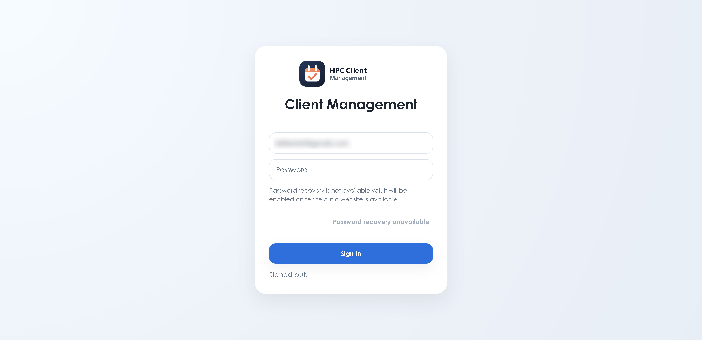

</details>

<details>
<summary><strong>Dashboard</strong></summary>

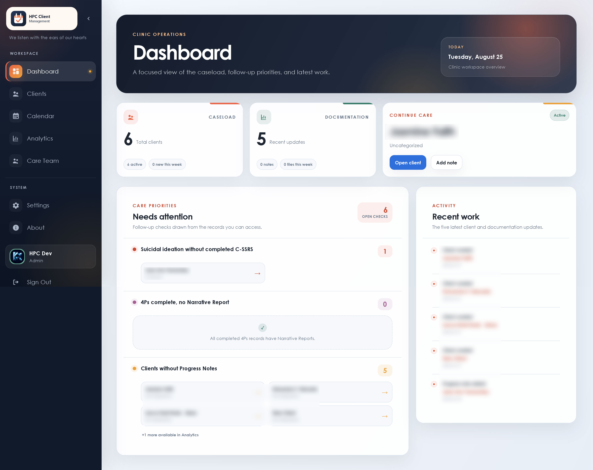

</details>

<details>
<summary><strong>Clients</strong></summary>

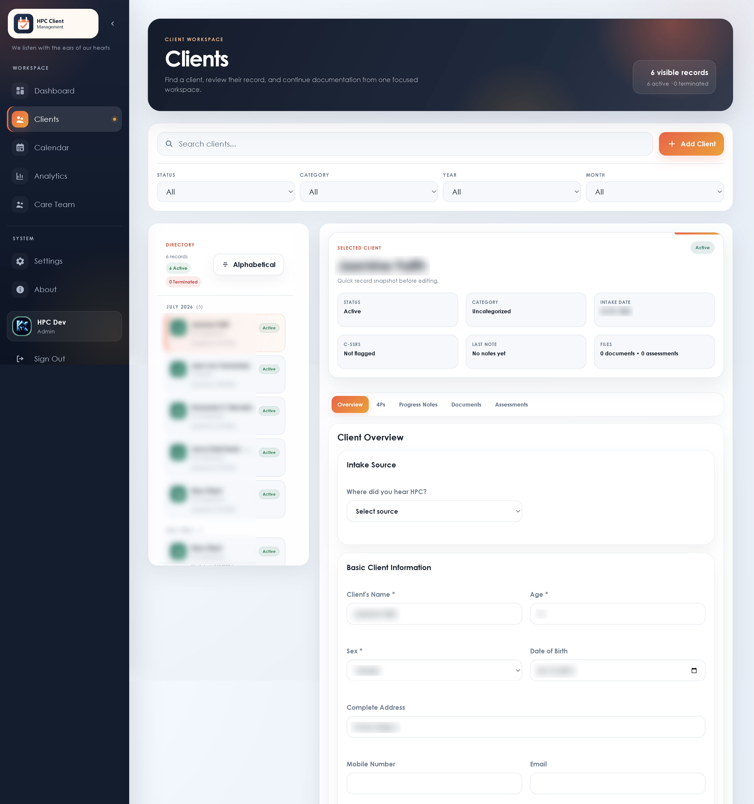

</details>

<details>
<summary><strong>Calendar</strong></summary>

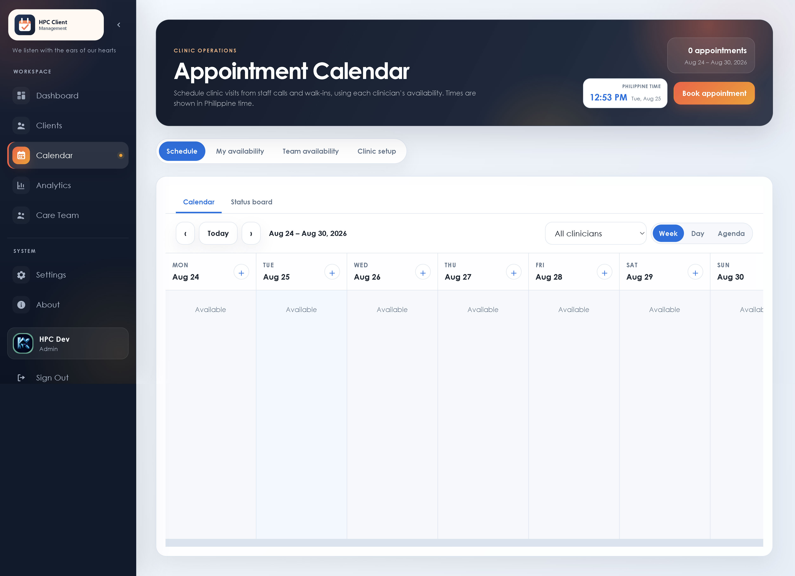

</details>

<details>
<summary><strong>Status Board</strong></summary>

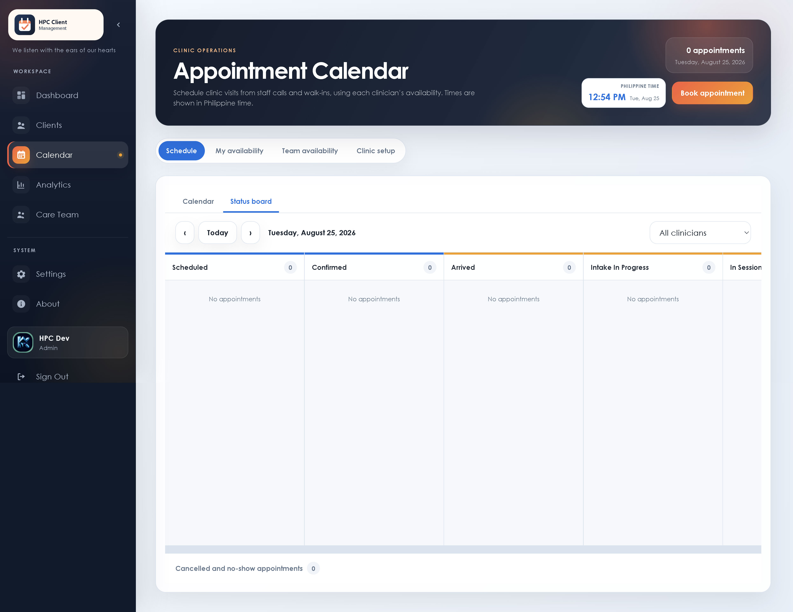

</details>

<details>
<summary><strong>My Availability</strong></summary>

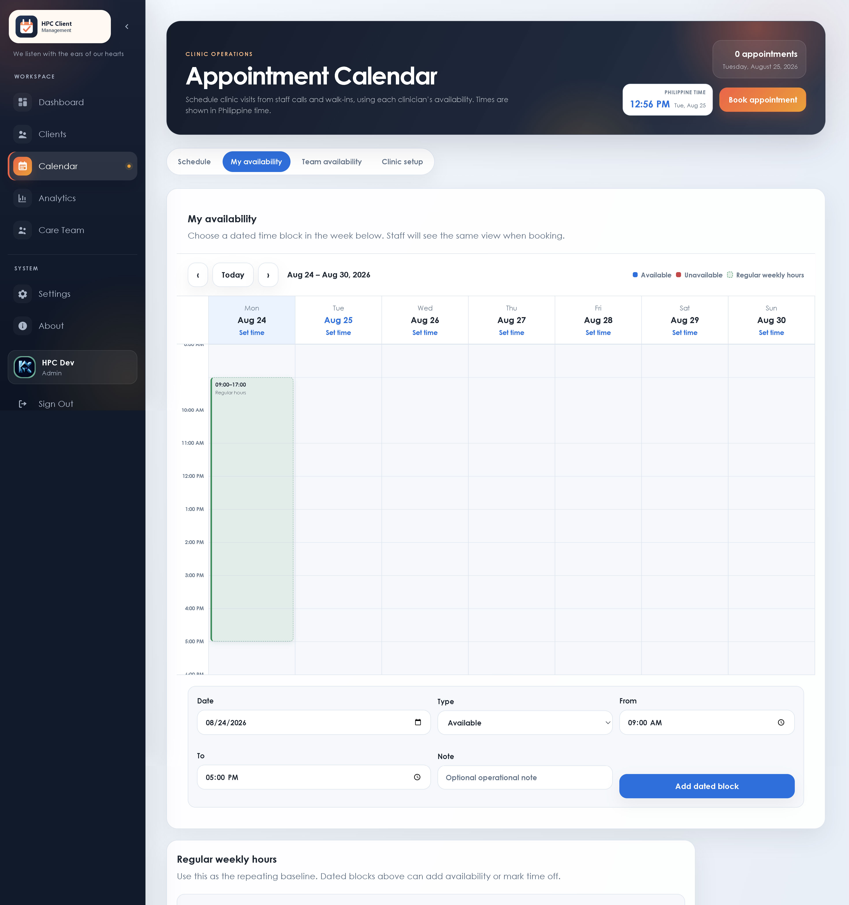

</details>

<details>
<summary><strong>Team Availability</strong></summary>

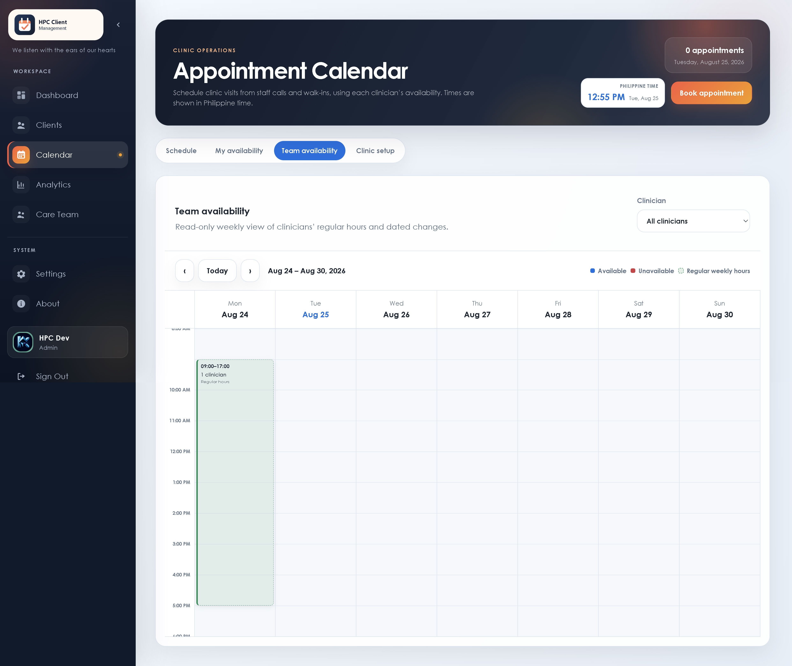

</details>

<details>
<summary><strong>Clinic Setup</strong></summary>

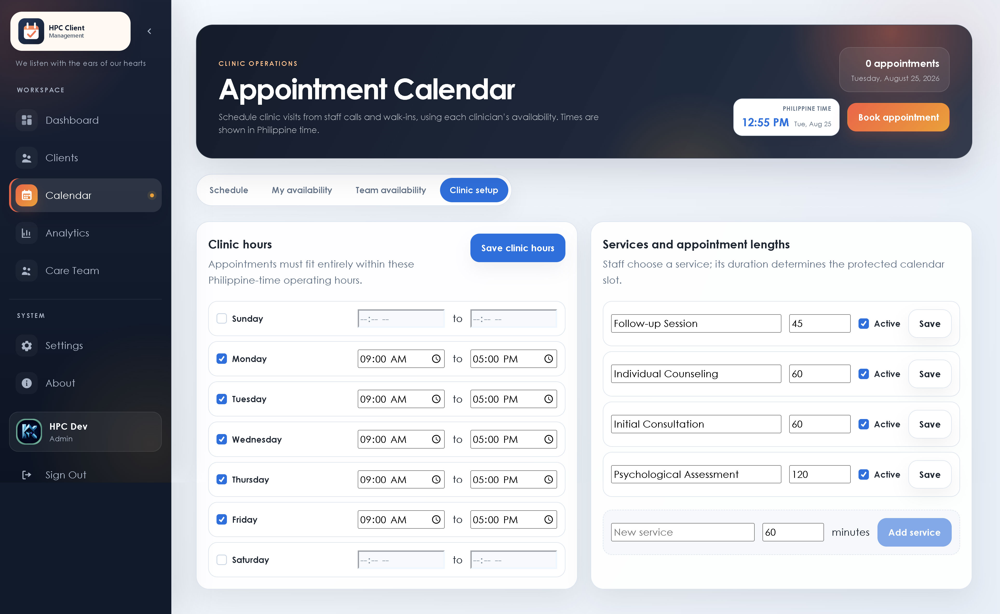

</details>

<details>
<summary><strong>Analytics</strong></summary>

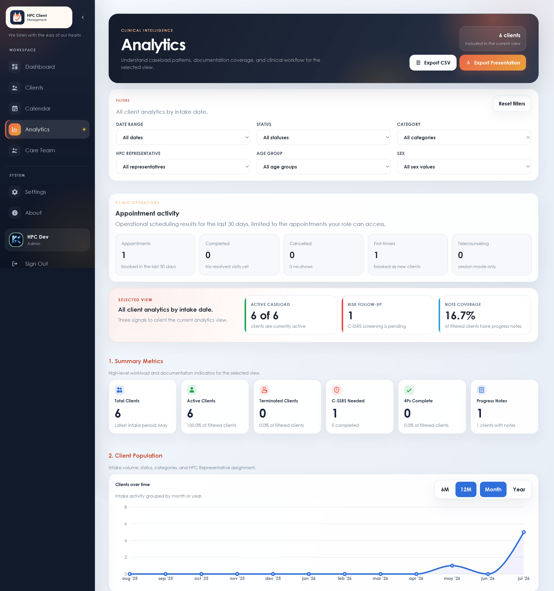

</details>

<details>
<summary><strong>Care Team</strong></summary>

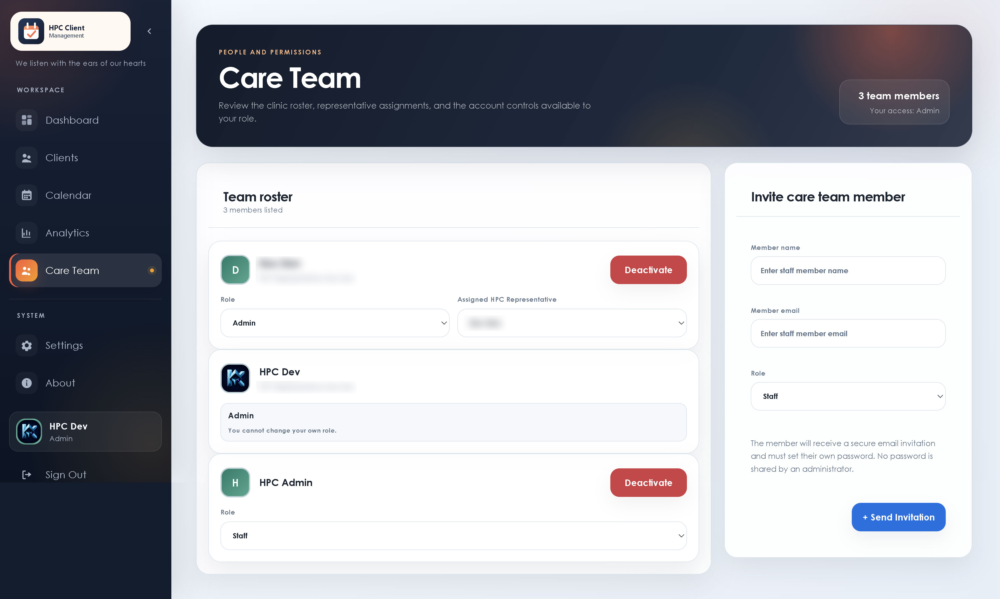

</details>

<details>
<summary><strong>Settings</strong></summary>

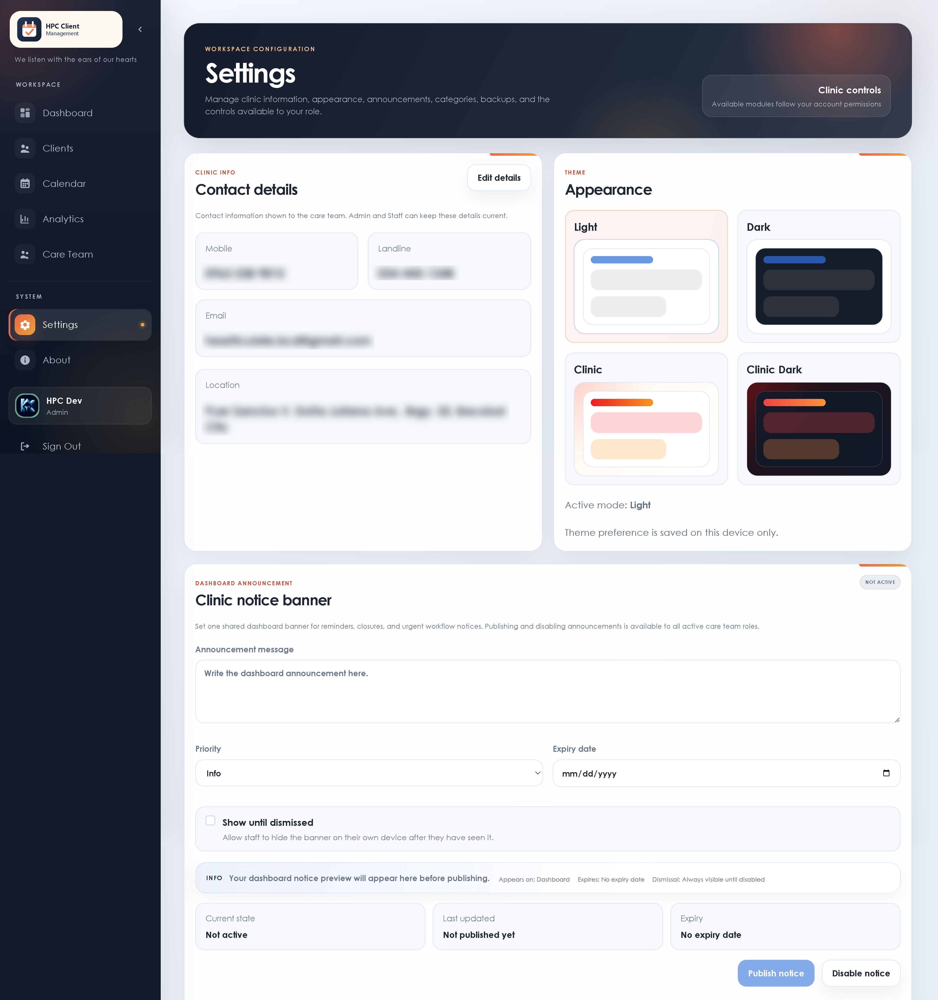

</details>

<details>
<summary><strong>About</strong></summary>

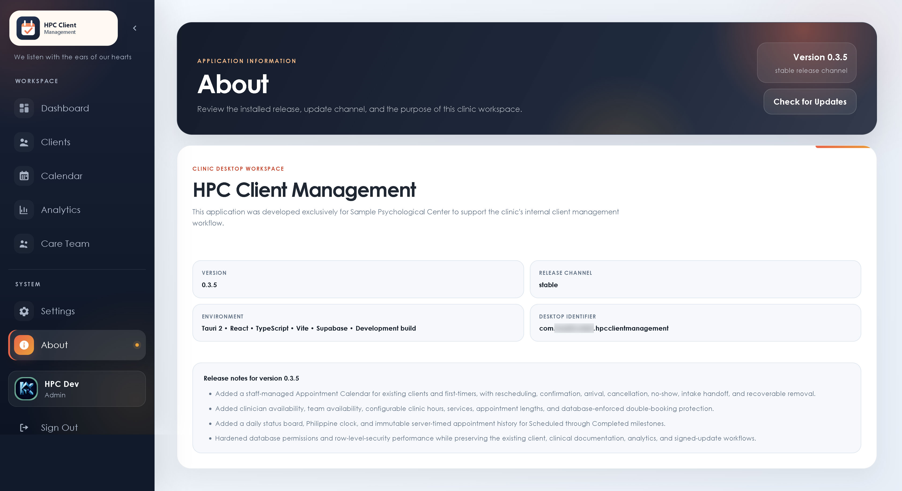

</details>

<details>
<summary><strong>Profile</strong></summary>

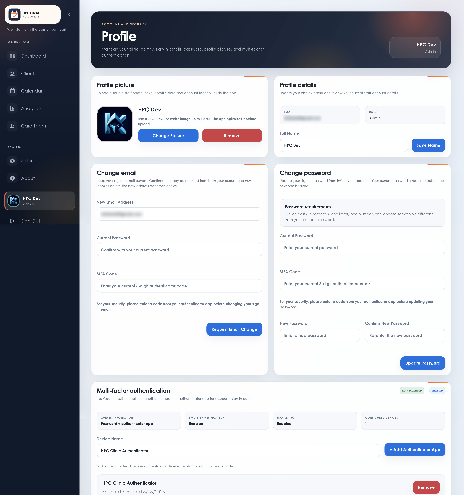

</details>

## Access model

| Role | Access summary |
| --- | --- |
| Admin | Clinic-wide access, Staff scheduling controls, calendar setup, account administration, backup restore, and system activity review |
| Psychologist / Counselor | Assigned clients, own calendar and availability, personal dashboard and analytics, and the care-team directory |
| Staff | Clinic-wide booking and appointment operations without authority over calendar setup, Admin accounts, backup restoration, or the system log |

## Public-source boundary

This repository is a privacy-safe source snapshot. It contains no clinic data,
real clinic branding, clinic contact details, live Supabase project references,
updater endpoints, signing material, deployment credentials, private backups,
or unredacted operational screenshots. The published screenshots were reviewed
and deliberately blurred; names and contact details in tests and examples are
fictional.

The deployed clinic application is configured separately with local environment
values and private operational assets. Those values are intentionally not
recoverable from this repository.

## Technology

| Layer | Technology |
| --- | --- |
| Desktop | Tauri 2 and Rust |
| Interface | React 19, TypeScript, and Vite 7 |
| Backend | Supabase Auth, Postgres, Storage, Row Level Security, and Edge Functions |
| Reporting | Recharts and PptxGenJS |

## Repository structure

```text
src/                  React application and feature modules
src-tauri/            Tauri desktop shell and generic configuration
supabase/migrations/  Database baseline migrations
supabase/functions/   Server-side Edge Functions
supabase/email-templates/ Generic authentication email templates
docs/                 User guides, approved screenshots, and verification files
public/               Generic application assets
tests/                Role, workflow, security, calendar, and privacy checks
```

## Getting started

### Requirements

- Node.js and npm
- Rust and the Windows prerequisites for Tauri
- A Supabase project
- Supabase CLI for migration and Edge Function deployment

### Configure the application

1. Install dependencies:

   ```bash
   npm ci
   ```

2. Copy `env.example` to `.env.local`.

3. Add the URL and publishable key for your own Supabase project:

   ```text
   VITE_SUPABASE_URL=https://YOUR_PROJECT_REF.supabase.co
   VITE_SUPABASE_PUBLISHABLE_KEY=YOUR_PUBLISHABLE_KEY
   ```

4. Replace the fictional clinic defaults and generic assets only in your private
   deployment configuration. Never commit secret or identifying values.

### Run locally

```bash
npm run dev
```

For the desktop shell:

```bash
npm run tauri dev
```

### Validate and build

Run these checks sequentially:

```bash
npm run lint -- --max-warnings=0
npm test
npm run build
npm run tauri build
```

The public Tauri configuration intentionally has no live updater endpoint. An
operator must configure private updater settings outside public source before
building a deployable signed release.

## Supabase setup

Apply the migrations in `supabase/migrations/` to a new Supabase project in
timestamp order, deploy the Edge Functions, configure server-side secrets, and
run the verification queries. Review Supabase Data API exposure and grants as
well as row-level-security policies before using the application with any real
records.

See the [migration runbook](docs/supabase-migration-runbook.md) for the generic
setup sequence.

## Documentation

- [Version 0.3.5 user guide](docs/user-guide-0.3.5.md)
- [Appointment Calendar architecture](docs/appointment-calendar.md)
- [Release history](CHANGELOG.md)
- [Supabase migration runbook](docs/supabase-migration-runbook.md)
- [Post-migration verification](docs/supabase-post-migration-verification.sql)
- [Appointment Calendar verification](docs/verify-appointment-calendar.sql)
- [Database-hardening verification](docs/verify-database-hardening.sql)
- [Authentication-trigger verification](docs/verify-live-auth-triggers.sql)

## Data handling

Runtime credentials and clinical data do not belong in Git. Frontend-safe
configuration belongs in an untracked `.env.local`; service credentials belong
in Supabase project secrets. Backup exports and uploaded clinical files must
remain in approved private storage.

## License

All rights reserved.
